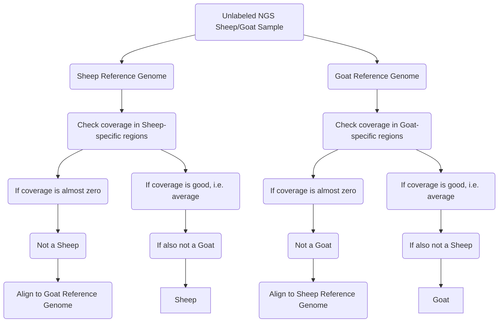

# A Genomic Approach for Accurate Identification of Sheep and Goat Species in Next-Generation Sequencing (NGS) Samples

Accurate species identification is a critical challenge, particularly in mixed or unlabeled next-generation sequencing (NGS) samples. The high degree of genomic similarity between Sheep (Ovis aries) and Goat (Capra hircus) poses difficulties in differentiation. We present a genomic methodology to distinguish between Sheep and Goats in NGS samples by leveraging specific genomic regions for each species. We defined the species-specific region as a genomic region with no coverage/alignment when applying the unmatched reference genome, while it has average coverage when mapping a matched sample. To identify such regions and to deal with the sequencing errors and misalignments, we empirically aligned Sheep samples to a Goat reference genome (ARS1.2) and aligned Goat samples to a Sheep reference genome (ARS-UI_Ramb_v2.0). After manual revision of the regions with <2 reads, we identified the largest species-specific and the most clear-cut regions for Sheep and Goat. Testing these regions on other test samples showed the accuracy of these regions in the identification of Sheep and Goat samples (screenshot folder). This approach offers a straightforward method for species identification, enhancing the efficiency of differentiation in mixed or unlabeled samples. By focusing on specific genomic regions, our method mitigates the challenges associated with the high similarity of Sheep and Goat genomes.

## Usage
The step-by-step procedure outlined here is designed for simplicity and effectiveness, offering a robust solution for researchers and practitioners working with NGS data:
### Step 1: 
Align the unlabeled sample to the Sheep reference genome (Tested on ARS-UI_Ramb_v2.0, Illumina, whole genome sequencing).
### Step 2: 
Align the unlabeled sample to the Goat reference genome (Tested on ARS1.2, Illumina, whole genome sequencing).
### Step 3: 
Check the coverage of the Sheep-specific regions in the Sheep-aligned file.
```
sh calculate_coverage.sh Sheep_specific_regions.bed /path/to/aligned_to_Sheep_reference.bam
```
### Step 4: 
Check the coverage of the Goat-specific regions in the Goat-aligned file.
```
sh calculate_coverage.sh Goat_specific_regions.bed /path/to/aligned_to_Goat_reference.bam
```
### Step 5:
a) If the coverage average is almost zero in the Sheep-specific region(s) and as expected (i.e., coverage average level) for the Goat-specific regions, then the sample is for a Goat.
b) If the coverage average is almost zero in the Goat-specific region(s) and as expected (i.e., coverage average level) for the Sheep-specific regions, then the sample is for a Sheep.


# Example
A Screenshot shows that the upper samples with almost zero coverage for the Goat-specific region are not Goat samples. While the lower samples with good coverage are real Goat NGS samples.


